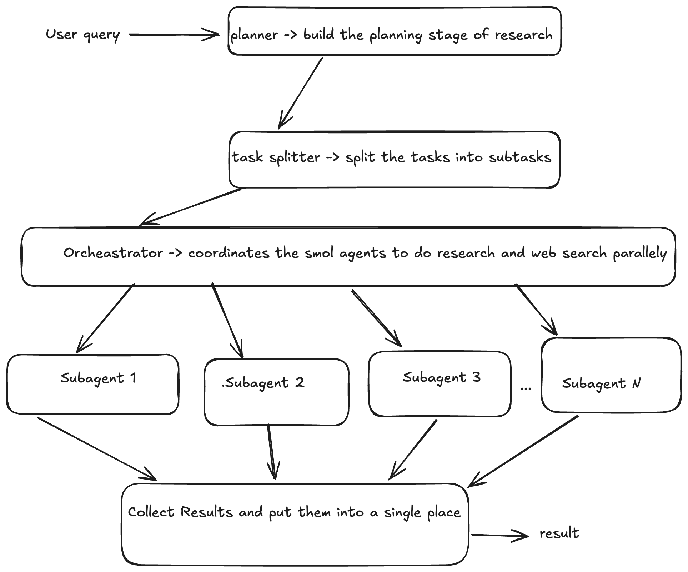

# research

an implementation of a multi-agent deep research system
using open-source models.

- inference provider: huuggingface
- web search : firecrawl mcp
- agent coordination: smolagents

## architecture

### explanation of user flow

- User wil type a question in the CLI
- a planner LLM will draft a thorough research map
- a splitter LLM will then turn that map into bite-sized, non-overlapping subtasks in JSON
- a coordinator agent spins up one sub-agent per subtask - every sub-agent can search and scrape the web through Firecrawl's MCP toolkit
- the coordinator stitches every mini-report into one polished markdown file.

## setup and configuration

[TODO]

## todo

- [v0.2] add support for memory
- [v0.2] using obscure cli to interact with obsidian to autonomously search for research topics

## references

- [Anthropic - How we built our multi-agent research system](https://www.anthropic.com/engineering/multi-agent-research-system)
- [autoresearch](https://github.com/karpathy/autoresearch)
